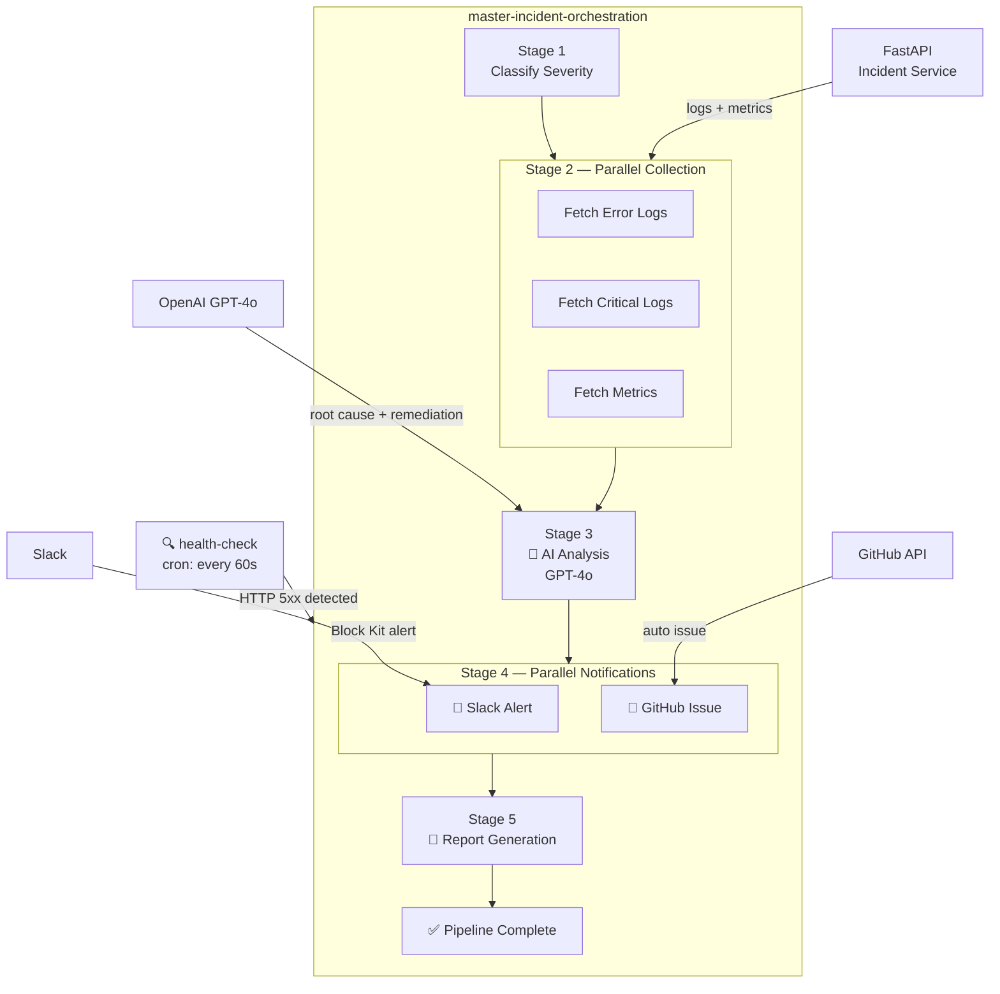

<div align="center">

# 🚨 Autonomous AI Incident Response Orchestrator

### *AI-Powered. Event-Driven. Fully Automated.*

[](https://kestra.io)
[](https://openai.com)
[](https://fastapi.tiangolo.com)
[](https://docker.com)
[](https://python.org)
[](LICENSE)

**Detects failures → Collects evidence → Runs AI analysis → Alerts your team → Creates tickets → Generates reports**

*All in under 60 seconds. Fully orchestrated by Kestra.*

---

[**🚀 Quick Start**](#-quick-start) · [**📐 Architecture**](#-architecture) · [**🎬 Demo**](#-demo) · [**🔄 Workflows**](#-kestra-orchestration-workflows) · [**🤖 AI Analysis**](#-ai-powered-analysis)

</div>

---

## 🎯 What Is This?

A production-grade **autonomous incident response platform** that uses [Kestra](https://kestra.io) as its orchestration backbone to automatically respond to production failures — from detection to resolution recommendations — without human intervention.

When your service goes down, this system:

| Step | Action | Time |
|------|--------|------|
| 🔍 **Detects** | Kestra health monitor fires (scheduled every 60s) | `0s` |
| 📊 **Classifies** | Severity (CRITICAL/HIGH/MEDIUM/LOW) + SLA timer | `+2s` |
| 📋 **Collects** | Logs + metrics from affected service (parallel) | `+5s` |
| 🤖 **Analyzes** | OpenAI GPT-4o root cause analysis + remediation | `+20s` |
| 💬 **Alerts** | Rich Slack Block Kit notification with AI summary | `+25s` |
| 🐙 **Tickets** | GitHub issue with full AI analysis + steps | `+25s` |
| 📄 **Reports** | Enterprise incident report (Markdown) | `+30s` |

**Total: ~30 seconds from failure to full incident response package.**

---

## 📐 Architecture

```
┌──────────────────────────────────────────────────────────────────┐
│                     KESTRA ORCHESTRATION ENGINE                   │
│                                                                    │
│  ┌──────────────────────────────────────────────────────────┐    │
│  │              master-incident-orchestration                │    │
│  │                                                           │    │
│  │  STAGE 1          STAGE 2            STAGE 3             │    │
│  │  ┌──────────┐    ┌────────────┐    ┌─────────────────┐   │    │
│  │  │ Classify │───▶│  Collect   │───▶│  AI Analyze     │   │    │
│  │  │ Severity │    │  Parallel: │    │  GPT-4o         │   │    │
│  │  └──────────┘    │ logs+metrcs│    └────────┬────────┘   │    │
│  │                  └────────────┘             │            │    │
│  │  STAGE 4                       STAGE 5      │            │    │
│  │  ┌───────────────────────┐    ┌──────────┐  │            │    │
│  │  │ Parallel Notifications│◀───│ Report   │◀─┘            │    │
│  │  │  ├─ Slack Alert       │    │ Generate │               │    │
│  │  │  └─ GitHub Issue      │    └──────────┘               │    │
│  │  └───────────────────────┘                               │    │
│  └──────────────────────────────────────────────────────────┘    │
│                           ▲                                        │
│              ┌────────────┘                                        │
│  ┌───────────────────────────────┐                                │
│  │   health-check  (cron: * * * * *)                             │
│  │   Polls /health every 60s                                      │
│  │   → fires master pipeline on failure                           │
│  └───────────────────────────────┘                                │
└──────────────────────────────────────────────────────────────────┘
          │                              │                  │
          ▼                              ▼                  ▼
┌──────────────────┐          ┌──────────────────┐  ┌────────────────┐
│  FastAPI Service  │          │   OpenAI API     │  │ Slack + GitHub │
│  payment-api sim  │          │   GPT-4o         │  │  Notifications │
│                   │          │                  │  │                │
│  GET /health      │          │  Root cause      │  │  Block Kit     │
│  GET /metrics     │          │  Remediation     │  │  Rich alerts   │
│  GET /logs        │          │  Severity        │  │  Auto issues   │
│  POST /simulate   │          │  Impact          │  │                │
└──────────────────┘          └──────────────────┘  └────────────────┘
```

### Mermaid Diagram



---

## 🗂️ Project Structure

```
autonomous-ai-incident-response-orchestrator/
│
├── 🐳 docker-compose.yml          # Full stack: Kestra + PostgreSQL + Incident Service
├── ⚙️  .env.example               # Environment configuration template
├── 📋 Makefile                    # Developer shortcuts
│
├── 📦 incident-service/           # FastAPI failure simulation service
│   ├── app.py                     # 6 realistic failure scenarios, logs, metrics
│   ├── requirements.txt
│   └── Dockerfile
│
├── 🔄 kestra/flows/               # ← THE HERO — 8 orchestration workflows
│   ├── 01-health-check-flow.yml           # Cron monitor → incident trigger
│   ├── 02-incident-trigger-flow.yml       # Signal enrichment + classification
│   ├── 03-log-collection-flow.yml         # Parallel log + metrics fetch
│   ├── 04-ai-root-cause-analysis-flow.yml # GPT-4o analysis engine
│   ├── 05-slack-notification-flow.yml     # Block Kit Slack alerts
│   ├── 06-github-issue-flow.yml           # Auto GitHub issue creation
│   ├── 07-incident-report-flow.yml        # Markdown report generator
│   └── 08-master-incident-orchestration-flow.yml  # ← Master pipeline
│
├── 📜 scripts/
│   ├── trigger-demo.sh            # Interactive demo launcher
│   ├── test-integrations.py       # Pre-demo integration checker
│   └── load-flows.sh              # Auto-loads flows on startup
│
└── 📄 reports/
    └── sample-incident-report.md  # Example AI-generated report
```

---

## ⚡ Quick Start

### Prerequisites

- [Docker Desktop](https://docker.com/products/docker-desktop) (with Compose v2)
- OpenAI API key ([get one here](https://platform.openai.com/api-keys))
- Slack webhook URL (optional — [create one](https://api.slack.com/messaging/webhooks))
- GitHub personal access token (optional — repo scope)

### 1. Clone & Configure

```bash
git clone https://github.com/jaybamroliya/autonomou-ai-incident-response-orchestrator
cd autonomous-ai-incident-response-orchestrator

# Configure your API keys
cp .env.example .env
# Edit file — at minimum set OPENAI_API_KEY
```

### 2. Start Everything

```bash
docker compose up -d
```

This starts:
- **Kestra** at http://localhost:8080 (orchestration engine + UI)
- **Incident Service** at http://localhost:8000 (FastAPI simulation service)
- **PostgreSQL** (Kestra backend storage)
- **Flow Loader** (auto-imports all 8 workflows into Kestra)

Wait ~30 seconds for startup, then open **http://localhost:8080** 🎉

### 3. Verify Setup

```bash
python3 scripts/test-integrations.py
```

### 4. Run Your First Demo

```bash
# Interactive demo script
bash scripts/trigger-demo.sh

# OR: trigger a CRITICAL database failure directly
curl -X POST "http://localhost:8000/simulate-failure?failure_type=database_connection_pool_exhausted"
```

Then open **http://localhost:8080** → Flows → `master-incident-orchestration` → watch it run!

---

## 🔄 Kestra Orchestration Workflows

All 8 workflows live in `kestra/flows/` and are automatically loaded into Kestra on startup.

| Flow | Trigger | Description |
|------|---------|-------------|
| `health-check` | ⏰ Cron (every 60s) | Polls service health, fires incident pipeline on failure |
| `incident-trigger` | 📡 Subflow | Enriches incident signal, classifies severity |
| `log-collection` | 📡 Subflow | Parallel fetch of error logs + metrics |
| `ai-root-cause-analysis` | 📡 Subflow | GPT-4o analysis with structured JSON output |
| `slack-notification` | 📡 Subflow | Block Kit Slack alert with AI summary |
| `github-issue` | 📡 Subflow | Auto-creates labelled GitHub issue with full report |
| `incident-report` | 📡 Subflow | Generates enterprise Markdown incident report |
| **`master-incident-orchestration`** | 📡 Subflow / Manual | **The hero — orchestrates all stages end-to-end** |

### Manual Trigger (Kestra UI)

1. Open http://localhost:8080
2. **Flows** → `ai.incident.response` → `master-incident-orchestration`
3. Click **Execute** → fill inputs:
   - `incident_id`: `INC-DEMO001`
   - `failure_type`: `database_connection_pool_exhausted`
   - `component`: `postgres-primary`
   - `error_message`: `FATAL: connection pool exhausted — max_connections=100 exceeded`
4. Watch the 5-stage execution graph animate!

---

## 🤖 AI-Powered Analysis

The AI engine sends enriched incident context to **GPT-4o** and returns:

```json
{
  "root_cause": {
    "summary": "PostgreSQL connection pool exhausted by batch migration + traffic spike",
    "confidence_pct": 94
  },
  "severity_assessment": {
    "level": "CRITICAL",
    "blast_radius": "~45,000 concurrent users",
    "slo_breach": true
  },
  "business_impact": {
    "revenue_risk": "$28,000/minute",
    "affected_users_estimate": "~45,000 active users"
  },
  "remediation": {
    "immediate_actions": [
      {
        "step": 1,
        "action": "Kill runaway batch migration",
        "command": "psql -c \"SELECT pg_terminate_backend(pid) FROM pg_stat_activity WHERE query LIKE '%migrate%';\"",
        "eta_minutes": 2
      }
    ],
    "estimated_resolution_minutes": 25
  }
}
```

### Failure Scenarios Simulated

| Scenario | Severity | HTTP Code |
|----------|----------|-----------|
| `database_connection_pool_exhausted` | CRITICAL | 503 |
| `memory_leak_oom` | CRITICAL | 500 |
| `disk_io_saturation` | CRITICAL | 507 |
| `downstream_api_timeout` | HIGH | 504 |
| `rate_limit_cascade` | HIGH | 429 |
| `certificate_expiry` | HIGH | 495 |

---

## ⚙️ Configuration

| Variable | Description | Required |
|----------|-------------|----------|
| `OPENAI_API_KEY` | OpenAI API key (GPT-4o) | ✅ Yes |
| `SLACK_WEBHOOK_URL` | Slack incoming webhook URL | Optional |
| `GITHUB_TOKEN` | GitHub personal access token | Optional |
| `GITHUB_REPO` | GitHub repo (`owner/repo`) | Optional |
| `FAILURE_PROBABILITY` | Auto-failure rate 0.0-1.0 (default: 0.3) | Optional |
| `OPENAI_MODEL` | OpenAI model (default: `gpt-4o`) | Optional |

---

## 🏗️ Tech Stack

| Component | Technology | Purpose |
|-----------|-----------|---------|
| **Orchestration** | [Kestra](https://kestra.io) | Workflow engine, DAG execution, scheduling |
| **AI Engine** | [OpenAI GPT-4o](https://openai.com) | Root cause analysis, remediation |
| **Simulation** | [FastAPI](https://fastapi.tiangolo.com) | Realistic incident simulation |
| **Alerting** | [Slack Block Kit](https://api.slack.com/block-kit) | Rich incident notifications |
| **Ticketing** | [GitHub API v3](https://docs.github.com/en/rest) | Auto issue creation |
| **Storage** | [PostgreSQL 15](https://postgresql.org) | Kestra backend |
| **Runtime** | [Docker Compose](https://docs.docker.com/compose/) | Local deployment |

---

## 🗺️ Future Roadmap

- [ ] PagerDuty integration — auto-escalation for CRITICAL incidents
- [ ] Prometheus + Grafana — real metrics monitoring
- [ ] Auto-remediation — Kestra executes fix commands automatically
- [ ] Multi-service monitoring — watch N services simultaneously
- [ ] Webhook receiver — accept alerts from Prometheus/Datadog/CloudWatch
- [ ] Post-mortem document generator — AI writes the full post-mortem
- [ ] SLA tracking dashboard — MTTR/MTTD metrics over time

---

## 📜 License

MIT — see [LICENSE](LICENSE)

---

<div align="center">

**Built for the [Kestra Orchestration Challenge](https://kestra.io)**

*AI-powered DevOps automation — from detection to resolution in 30 seconds.*

</div>
